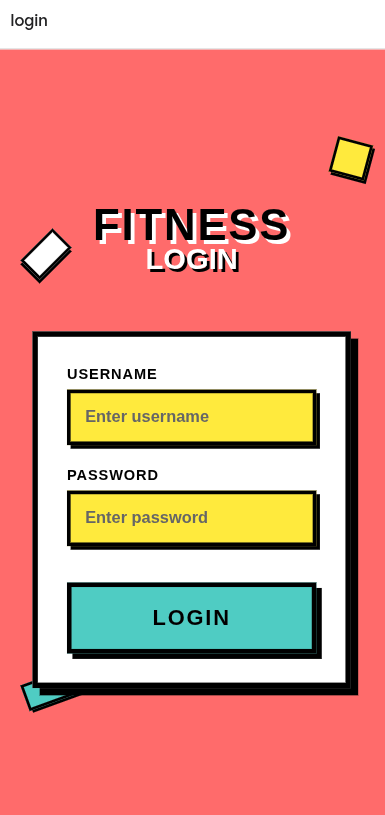
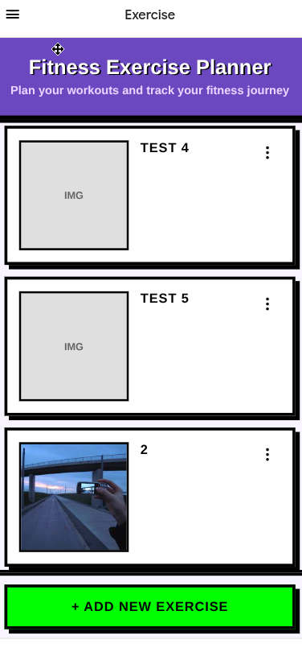
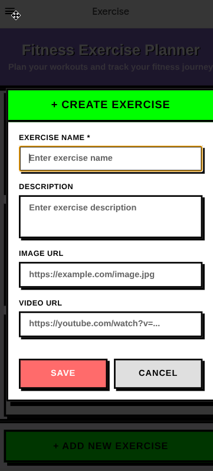
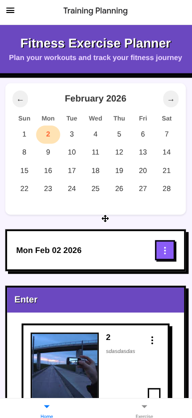
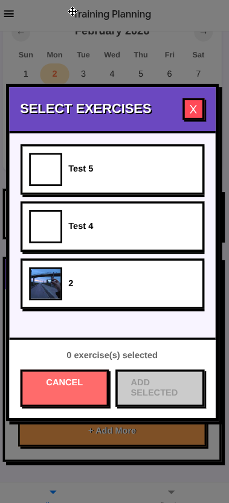

# Fitness Exercise Planner
<div align="center">
  
</div>

## Overview

I’ve just been using my image gallery to track my training, but honestly? I can code. And since I can just have AI handle the UI styling—which used to be the biggest time-sink—there’s no reason not to just build my own Android app.

## Demo

### App Screenshots

<div align="center">

#### Authentication



#### Exercise Management




#### Session & Workout Tracking




</div>

## Architecture & Tech Stack

- **Frontend**: React Native with Expo
- **Backend**: Supabase
- **Routing**: Expo Router with file-based navigation
- **Storage**: Supabase Storage for images and videos
- **UI Components**: Custom components with React Native

## Core Features

### Exercise Management

- **Create Exercises**: Add exercises with name, description, image, and video URLs
- **Exercise Library**: Browse and manage your personal exercise collection
- **Exercise Details**: View comprehensive information about each exercise
- **Edit & Delete**: Full CRUD operations for exercise management

### Session Management

- **Calendar Integration**: Select dates to view and create workout sessions
- **Session Creation**: Create workout sessions with custom names
- **Exercise Assignment**: Add multiple exercises to sessions from your library
- **Daily Tracking**: View all exercises planned for specific dates

### User Interface

- **Protected Routes**: Authentication-based navigation
- **Tab Navigation**: Easy switching between exercises and session views
- **Modal Dialogs**: Intuitive forms for creating and editing content
- **Touch Interactions**: Card-based interface with tap to view details

## Project Structure

```
app/
├── (protected)/          # Authentication-protected routes
│   ├── (tabs)/          # Main tab navigation
│   │   ├── index.tsx    # Session management & calendar view
│   │   └── exercise.tsx # Exercise management
│   └── _layout.tsx      # Protected layout wrapper
├── login.tsx            # Login screen
└── sign_in.tsx         # Sign-in screen

components/              # Reusable UI components
├── calendar.tsx         # Calendar component
├── create-edit-exercise.tsx # Exercise form
├── create-session-dialog.tsx # Session creation
├── add-exercise-dialog.tsx # Add exercises to session
├── exercise-detail.tsx  # Exercise detail view
└── tick-card.tsx       # Card component

hooks/                  # Custom React hooks
├── useExercise.ts      # Exercise operations
├── useSession.ts       # Session operations
└── useSessionExercise.ts # Session-exercise relationships

utils/                  # Services and utilities
├── exerciseService.ts  # Exercise API calls
├── sessionService.ts   # Session API calls
├── sessionExerciseService.ts # Session-exercise API calls
├── supabase.tsx       # Supabase client configuration
└── authContext.tsx    # Authentication context
```

## Installation

### Prerequisites

- Node.js (v16 or higher)
- npm or yarn
- Expo CLI (`npm install -g @expo/cli`)
- Supabase account and project

### Setup

1. **Clone the repository**

   ```bash
   git clone https://github.com/knguyennt/fitness-exercise-planner.git
   cd fitness-exercise-planner
   ```

2. **Install dependencies**

   ```bash
   npm install
   ```

3. **Environment Configuration**

   Set up your Supabase credentials:
   - Copy `.env.example` to `.env`
   - Add your Supabase project details:
     ```env
     EXPO_PUBLIC_SUPABASE_URL=your_supabase_project_url
     EXPO_PUBLIC_PUBLISHABLE_KEY=your_supabase_anon_key
     ```

4. **Database Setup**

   Create the following tables in your Supabase project:
   - `Exercise` (id, name, description, image_url, video_url, user_id, created_at)
   - `Session` (id, name, created_at)
   - `SessionExercise` (session_id, exercise_id, created_at)

5. **Start the development server**
   ```bash
   npx expo start
   ```

### Running the App

Choose your preferred development environment:

- **Development Build**: For full native functionality
- **Android Emulator**: Test on Android devices
- **iOS Simulator**: Test on iOS devices (macOS only)
- **Expo Go**: Quick testing with limited functionality

## Development

The app uses Expo Router for navigation with a file-based routing system. Key development areas:

- **Authentication**: Managed through Supabase Auth with protected routes
- **State Management**: React hooks for local state, Supabase for data persistence
- **Component Structure**: Modular design with reusable components
- **Data Flow**: Service layer pattern for API interactions

## Future Enhancements

- Image and video upload functionality
- Exercise categorization and filtering
- Workout statistics and progress tracking
- Social sharing features
- Offline synchronization
